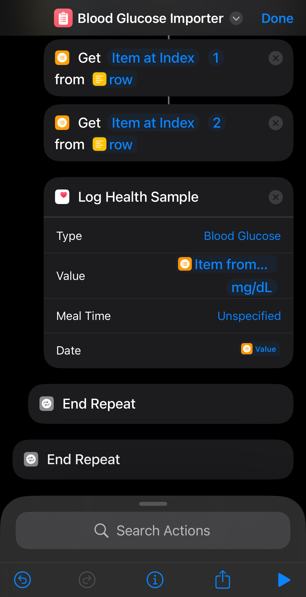

# Blood Glucose Data Import Guide

This repository contains a step-by-step guide on how to import blood glucose data from sensor cloud services into Apple Health using Apple's built-in Shortcuts application. While this guide was originally created for the Libre Freestyle 2 sensor, the approach is adaptable to any glucose sensor that provides measurement datetime and value data.

This guide is prepeared for the iOS devices. 

## Overview

The process involves three main steps:

1. Downloading data from the sensor's cloud service (e.g., LibreView website)
2. Formatting and preparing the data using Google Sheets
3. Using an Apple Shortcuts script to import the data into Apple Health

## Detailed Steps

### 1. Downloading Data from LibreView

This approach assumes you are already synching the data with cloud. In Libre Freestyle case, the cloud is the [LibreView](https://www.libreview.com/) site.  

* Download the glucose data from the [LibreView](https://www.libreview.com/) site.

### 2. Formatting Data
Import the downloaded csv to the google slides.
* This data have lots of columns
    * for the Libreview, we need to have only below columns for the **Record Type: 1** ones 
        * Device Timestamp
        * Scan Glucose mg/dL

So filter the values **Record Type: 1** ones, than isolate the 2 required columns into a new sheet. 

Thanks to [Sam8007](https://www.reddit.com/r/shortcuts/comments/9jszwn/comment/k40bn4w/?) we need to format the dates just like `yyyy.mm.dd ‘at’ hh:mm:ss` E.g: 2023.10.08 at 22:12:10

We will create a new Google Sheet with only the data values, excluding the header row containing column names. E.g.:

|2024.09.26 at 14:25:00   | 94                 |
|-------------------------|--------------------|
| 2024.09.26 at 12:56:00   | 79                 |
| 2024.09.26 at 12:57:00   | 81                 |
| 2024.09.26 at 13:25:00   | 97                 |

### 3. Using Apple Shortcuts

Here's the link for the Shortcuts script:

https://www.icloud.com/shortcuts/1d1ca07a917d4b138b61a83d6eb2bd82 

Follow the link install the script. The script will ask you the file you have prepeared. 

## Additional Information

- Ensure you have using the **same units** for both the input file and the shortcuts' health logger. 
- Some sountires (such as Türkiye) may not have access to blood glucose menu an their Apple Health app. You may consider to change the region of your iOS device to any supported country (i.e.:USA)

## Contributing

Feel free to contribute to this guide by submitting pull requests or opening issues for suggestions and improvements.

## License

MIT Licence
